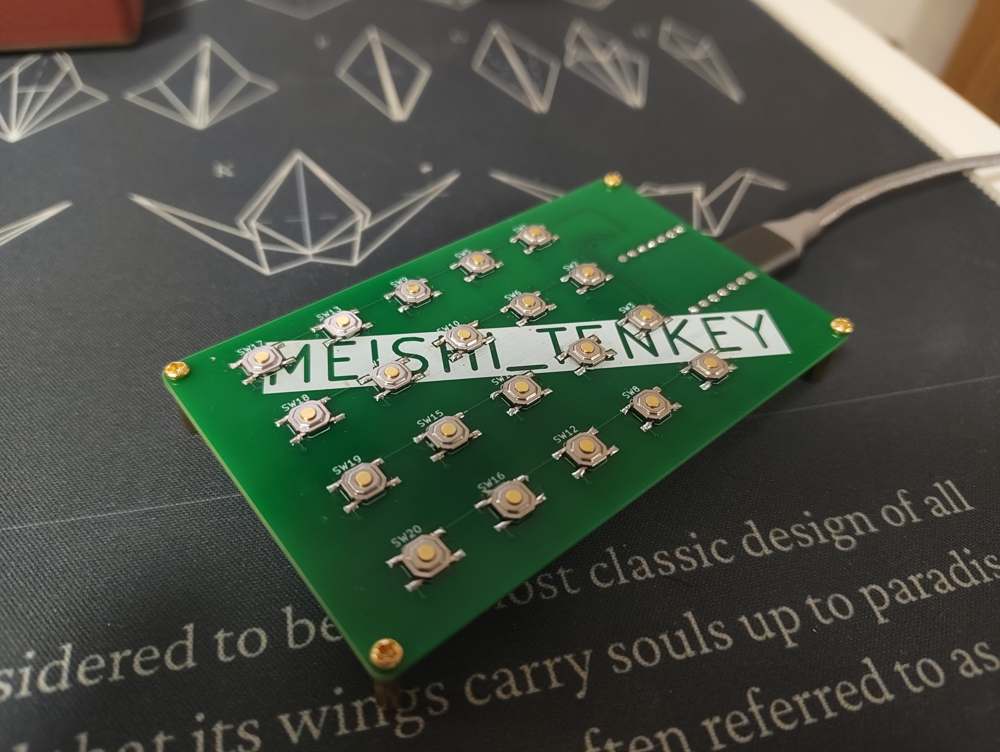
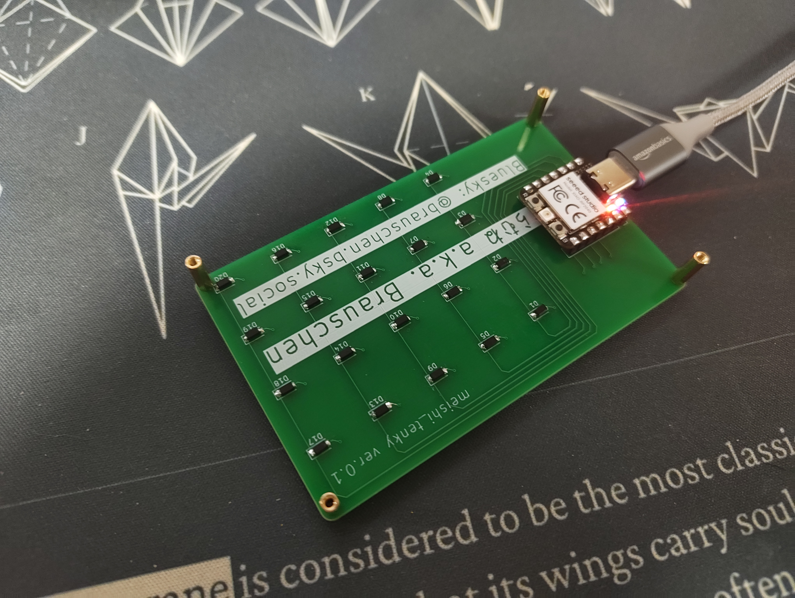
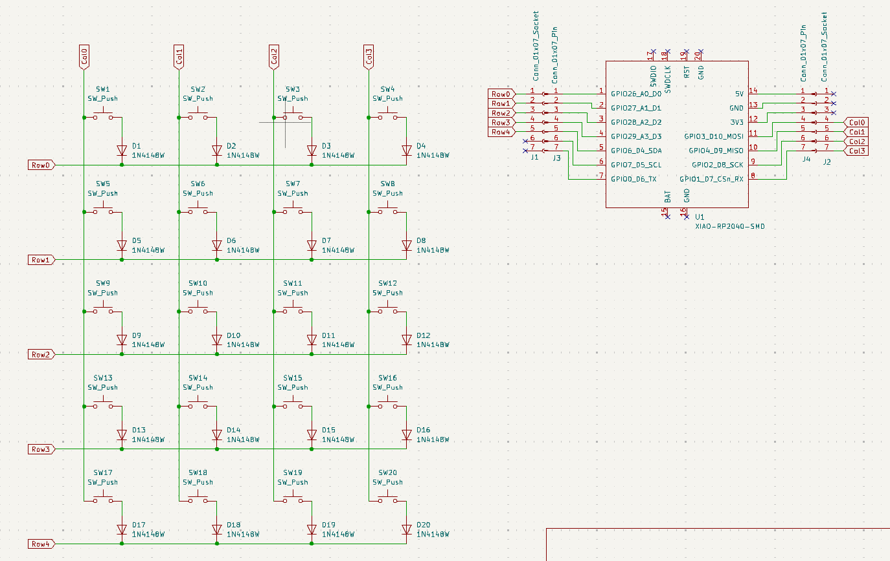
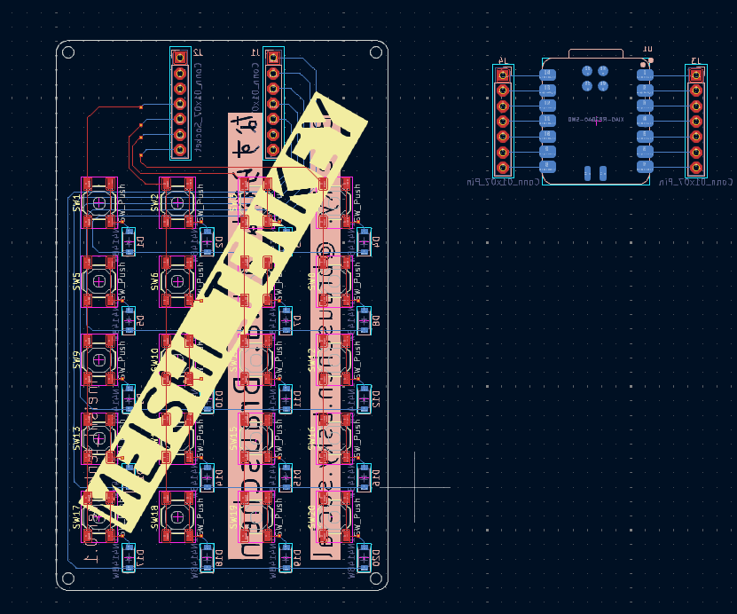

# meishi_tenkey

 

 

XIAO RP2040 を使用した 5x4 テンキーキーボード

- QMKファームウェア対応
- 2レイヤー（テンキー / ナビゲーション）

## 注意事項

v0.1のPCBではマイコンのスルーホールの間隔を間違えており、Xiaoのピンヘッダより僅かに広いです。先にピンヘッダとマイコンを挿してからハンダ付けしてください。Xiaoのピンヘッダを先に実装するとPCBに挿さらなくなります。

> **v0.2で修正済み。** v0.2以降のPCBではこの問題は解消されています。

## レイアウト

```
┌───┬───┬───┬───┐
│NLk│ / │ * │ - │
├───┼───┼───┼───┤
│ 7 │ 8 │ 9 │ + │
├───┼───┼───┼───┤
│ 4 │ 5 │ 6 │ + │
├───┼───┼───┼───┤
│ 1 │ 2 │ 3 │Ent│
├───┼───┼───┼───┤
│ 0 │Fn │ . │Ent│
└───┴───┴───┴───┘
```

## 部品表

| 部品 | 数量 | 備考 |
|------|------|------|
| XIAO RP2040 | 1 | ピンヘッダで取り付け |
| タクトスイッチ | 20 | 薄型（厚さ約1.5mm） |
| ダイオード（1N4148W） | 20 | |

## ファームウェア

### 書き込み方法

1. XIAO RP2040 の B ボタンを押しながら R ボタンを押す
2. PC にリムーバブルドライブとしてマウントされる
3. `qmk_firmware/meishi_tenkey_default.uf2` をドライブにコピー

### キーマップのカスタマイズ

レイアウトを変更したい場合は、Linux または WSL 上に QMK 環境を構築し、以下の手順で行ってください。

1. `./qmk_firmware/keyboards/meishi_tenkey` を QMK 本体の `keyboards/` 以下にコピー
2. `keymaps/default/keymap.c` を編集
3. `qmk compile -kb meishi_tenkey -km default` でビルド
4. 出力された `.uf2` ファイルを XIAO RP2040 に書き込み

## PCB設計環境

KiCad 9.0.7 で編集しています。

- [Xiao_Kicad_Library](https://github.com/Seeed-Studio/Xiao_Kicad_Library) - XIAO RP2040 のシンボル / フットプリント

## ライセンス

GPL-2.0

ハードウェア部分（KiCad）については、将来的に CERN-OHL-S へ変更する可能性があります。
